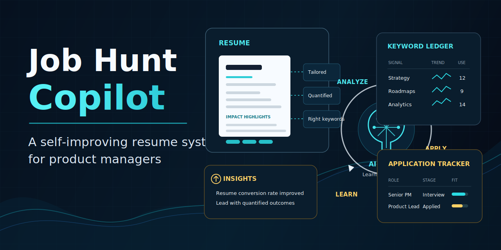

# Job Hunt Copilot — Claude Skill



A Claude Code skill that builds a complete, self-improving job-search system for Product Managers. One setup conversation creates everything you need — every application after that makes the system smarter.

**Never used Claude Code before?** No problem. This guide walks you through every step from scratch.

---

## What is this, exactly?

This is a **skill** — a set of instructions you install into Claude Code once, then use forever. After setup you'll have:

1. **A personal achievement bank** — a file of your real accomplishments and metrics that Claude draws on every time you need a resume. No more starting from scratch.
2. **A one-command resume tailor** — paste a job description, say "tailor my resume," and Claude produces a tailored resume + cover letter built from your own words.
3. **A learning loop** — every application outcome (rejection, callback, interview) gets logged and fed back so your resumes improve over time.

---

## Before you start: what you'll need

- **Claude Code installed.** If you haven't done this yet, download it at [claude.ai/code](https://claude.ai/code) and follow the setup guide.
- **Your existing resume** (optional but highly recommended — see the [Resume RAG section](#step-3-optional-add-your-existing-resume) below).

---

## Step 1 — Install the skill

Open your terminal and run **one** of these commands:

**Option A — install directly from the web (easiest):**

```bash
claude skill install https://github.com/deewang/product-manager-resume-writing-skill/raw/main/setup-job-copilot.skill
```

**Option B — clone first, then install locally:**

```bash
git clone https://github.com/deewang/product-manager-resume-writing-skill.git
cd product-manager-resume-writing-skill
claude skill install ./setup-job-copilot.skill
```

That's it. The skill is now available in every Claude Code conversation.

---

## Step 2 — Run the setup

Open a new Claude Code conversation and say something like:

- `"Set up a job search system for me"`
- `"Build me a job hunt copilot"`
- `"I keep rewriting my resume for every job — help me automate it"`
- `"Set up the job copilot"`

Claude will start an interview — it'll ask you about your experience, achievements, and the kinds of roles you're targeting. Answer honestly; this is where it builds your achievement bank.

At the end of the conversation, Claude creates a working folder on your computer with all the files it needs.

---

## Step 3 (optional) — Add your existing resume

After setup, Claude creates a folder called **`Resume RAG`** inside your working directory. This is where you drop your existing resume so Claude can read it and use it as context when tailoring future applications.

**How to add your resume:**

Drop your resume file into the `Resume RAG` folder. Claude can read:

- **PDF** — just copy your existing PDF straight in. No conversion needed.
- **Markdown (`.md`)** — a plain-text format that Claude reads especially well. If you'd like to convert your resume to Markdown first:
  - **Using Claude Code:** open your resume PDF or Word doc, ask Claude `"Convert this resume to Markdown"` and paste or attach the content.
  - **Using Codex (OpenAI):** same approach — paste your resume text and ask it to output Markdown.

The more context Claude has from your existing resume, the better your tailored resumes will be.

---

## What gets created

After setup, your working folder will look like this:

| File | What it's for |
|------|--------------|
| `profile.md` | Your achievement bank — every bullet and metric, grouped by theme. The only source Claude pulls resume content from. |
| `resume-format.md` | Your preferred document layout, section order, and writing style. |
| `search-config.md` | Target titles, locations, salary floor, and keywords you want to filter by. |
| `boards-and-companies.md` | Job boards and target companies with links to their careers pages. |
| `learnings-log.md` | A running log of every application outcome (rejections, callbacks, interviews). |
| `hypotheses.md` | Theories about what's working and what isn't — Claude updates these over time. |
| `search-patterns.md` | Confirmed patterns promoted from your hypotheses. |
| `keyword-ledger.md` | Which keywords and framings earned callbacks vs. ATS rejections. |
| `Resume RAG/` | **Drop your existing resume here** (PDF or .md). Claude uses it as reference when tailoring. |
| `roles-tracker` | Your application pipeline (Markdown, CSV, or Notion — whichever you prefer). |

A **`resume-tailor` sub-skill** is also created and installed automatically. After setup, paste any job description and say `"tailor my resume"` — Claude reads all your living files fresh and produces a tailored resume and cover letter.

---

## Using it day-to-day

**To tailor a resume for a new job:**
1. Find a job posting you want to apply for.
2. Open a Claude Code conversation.
3. Paste the job description and say: `"Tailor my resume for this role."`

**To log an outcome and improve your system:**
1. After hearing back from an application (any result), open Claude Code.
2. Say: `"Do a learning pass on my job search"` and tell Claude what happened.
3. Claude updates your logs, hypotheses, and keyword ledger automatically.

---

## Principles

- **Truthful tailoring only.** Claude reframes your real achievements — it never invents metrics or employers.
- **Living files are the source of truth.** Claude reads your files fresh on every run, so updates are always reflected.
- **Every application is a data point.** The system learns which roles, framings, and keywords work specifically for you.

---

## Files in this repo

```
setup-job-copilot.skill              # The installable skill (start here)
setup-job-copilot/
  SKILL.md                           # Skill source (readable version)
  references/
    file-templates.md                # Structure for each living file
    resume-tailor-skill.md           # The resume-tailor sub-skill
```
